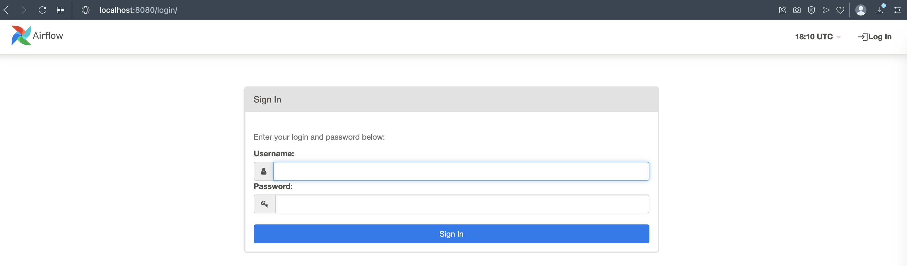
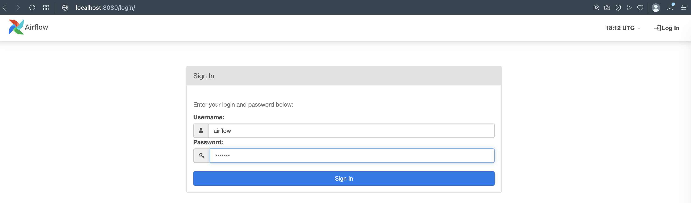
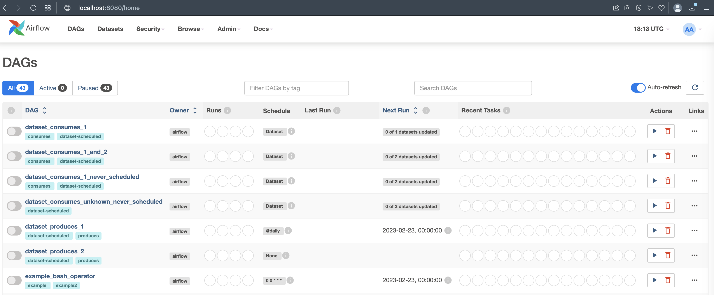

# PRE SETUP

## Prerequisites

* [Docker][install_docker]

## Steps

### Step 1 - Composer

* Run the docker-compose.yml that start docker containers that has Airflow Celery Components

  ```sh
  docker-compose up -d
  ```

### Step 2 -  Airflow Web UI

Once docker-compose runs all the Airflow Celery component containers

* Open a web browser and open following URL to access to Airflow Web UI:
  * <http://localhost:8080>

    

* Login
  * username: `airflow`
  * password: `airflow`

    

* Example DAG's

  

## Links

* [Install Docker][install_docker]

[install_docker]: https://docs.docker.com/engine/install/
